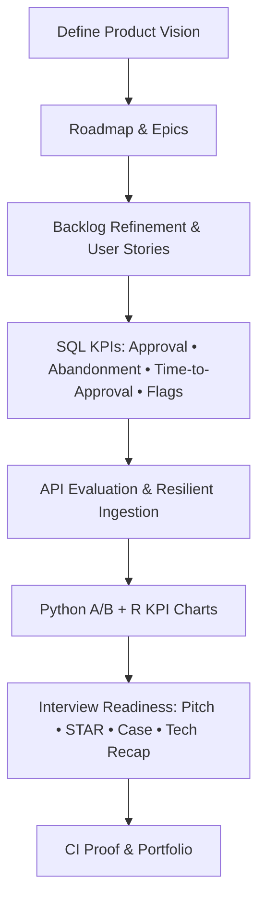

# 🚀 Technical Product Manager Crash Course (5-Day Prep)

[](./LICENSE.md)


---

## 📖 Overview

This **5-day crash course** prepares you for a **Technical Product Manager (TPM)** interview in a **fintech/lending** context (e.g., a BorrowWorks-style **Lending Platform**).  
It blends **Agile product craft**, **SQL data fluency**, **API ingestion**, **Python & R analytics**, and **interview storytelling** into a single, hands-on program.

By the end you will:

- ✅ Create a **product vision & roadmap**, and write **interview-ready user stories**.  
- ✅ Use **SQL** to validate product decisions (conversion, abandonment, time-to-approval, fraud flags).  
- ✅ Evaluate and prototype **APIs** (auth, pagination, rate limits, retries, idempotency).  
- ✅ Run a small **A/B analysis in Python**, plot KPIs in **R**, and brief findings clearly.  
- ✅ Deliver a **2-minute pitch**, **3–5 STAR stories**, and a **product case** under interview conditions.

> **Good news:** You don’t need production data or paid services. This repo includes **toy datasets**, **mock APIs**, and **CI checks** so you can prove capability without external dependencies.

---

## 👤 Who This Is For

- **New to TPM / career-switcher:** You’ll get simple explanations first, then optional deeper dives.  
- **Product Manager upskilling:** You’ll connect product judgment to SQL, APIs, and experimentation.  
- **Engineer → TPM:** You’ll learn to translate engineering detail into business decisions and narratives.

---

## 🧭 How to Use This Course

- Each day has a **README**, a step-by-step **lesson**, and an optional **AI coach prompt** (beginner + cheat-sheet).  
- You’ll produce **visible artifacts** (SQL files, scripts, charts, markdown docs) and run **lightweight CI** to prove repeatability.  
- Choose your track:
  - **Essentials Track (2–3 hrs/day):** Do the core tasks and skim the prompts.  
  - **Full Proof Track (3–4 hrs/day):** Complete all tasks + CI + optional approval gates.

---

## 🧰 Prerequisites & Setup (15–25 min)

- **Git** installed and authenticated with GitHub.
- **Python 3.10+** (used on Days 3–4 and for Day 5 validator).
- **R** (Day 4 charts).
- **Optional:** `sqlite3` CLI (Day 2). If you don’t have it, we provide pure-Python fallbacks.

**Clone & Check:**
```bash
git clone <your-fork-or-repo-url>
cd tpm-lending-platform-crashcourse
ls
```

**Tip:** All lessons run locally—**no production secrets** or external vendors are required.

---

## 📑 Table of Contents

- [Day 1 – Product Fundamentals](#day-1--product-fundamentals)
- [Day 2 – SQL & Data Fluency](#day-2--sql--data-fluency)
- [Day 3 – API & Data Ingestion](#day-3--api--data-ingestion)
- [Day 4 – Python & R for Product Managers](#day-4--python--r-for-product-managers)
- [Day 5 – Interview Readiness](#day-5--interview-readiness)
- [🎯 What You’ll Produce (Deliverables)](#-what-youll-produce-deliverables)
- [📂 Folder Structure](#-folder-structure)
- [🛠 Tech Stack](#-tech-stack)
- [🔄 End-to-End Workflow](#-end-to-end-workflow)
- [✅ Success Checklist & Rubric](#-success-checklist--rubric)
- [🧑‍🏫 Prompts & Coaching](#-prompts--coaching)
- [📚 Resources](#-resources)
- [⚖ License](#-license)

---

## 📅 Day-by-Day Breakdown

### Day 1 – Product Fundamentals
**Plain English:** Learn to turn a business goal into a **vision → roadmap → epics → stories** you can defend.

**You’ll cover:**
- Product **vision** and **Now / Next / Later** **roadmap**.
- Writing **user stories** with **INVEST** and **acceptance criteria**.
- Backlog refinement & **stakeholder trade-offs** (client customization vs platform scalability).

**Hands-on:**
- Draft a **Loan Pre-Approval** feature epic and 5–7 user stories with acceptance criteria.
- Create a **1-page roadmap** that balances speed, risk, and scale.

**Interview signal:** Clear problem framing, crisp stories, measurable outcomes, trade-off awareness.

> Folder: `Day1_Product_Fundamentals/`

---

### Day 2 – SQL & Data Fluency
**Plain English:** Use SQL to **answer product questions**, not just to “query tables.”

**You’ll cover:**
- `SELECT`, `JOIN`, `GROUP BY`, calculated KPIs.
- Key funnel metrics: **approval %**, **abandonment %**, **time-to-approval**, **fraud flags**.
- Lightweight **tests** and **CI** so your analysis is repeatable.

**Hands-on:**
- Build a local **SQLite** DB from `schema.sql` + `seed.sql`.
- Run **KPI queries** in `queries.sql`.
- Add tiny **pytest** checks and **GitHub Actions** CI.

**Interview signal:** You connect data to decisions (e.g., which device/channel to fix), and your work is reproducible.

> Folder: `Day2_SQL_Data_Fundamentals/`

---

### Day 3 – API & Data Ingestion
**Plain English:** Evaluate an external API like a pro, and build a tiny, **reliable client** that won’t break production.

**You’ll cover:**
- REST basics (auth, pagination, **429** rate limiting, **retries/backoff**, **idempotency**).
- Schema validation and safe **upserts** into a DB.
- **Vendor scorecard** (auth, latency, error behavior, cost, SLA).

**Hands-on:**
- Use `python_api_demo.py` to simulate requests (no real secrets).
- Ingest a small batch into SQLite with `ingest_to_sqlite.py`.
- Add **smoke tests** and run **CI**.

**Interview signal:** You understand reliability, not just “calling an API.”

> Folder: `Day3_API_Data_Ingestion/`

---

### Day 4 – Python & R for Product Managers
**Plain English:** Tell a decision story with simple stats and charts—**no heavy math required**.

**You’ll cover:**
- Python A/B analysis: **conversion**, **lift**, and a **simple recommendation** (ship / hold / more data).
- R charts for weekly KPI trends (e.g., **time-to-cash**).
- Creating an **exec summary** that a non-technical leader can act on.

**Hands-on:**
- Run `ab_test.py` on `sample_ab.csv` → save `figures/ab_lift.png`.
- Run `plot_kpis.R` on `sample_kpis.csv` → save `figures/kpi_trend.png`.
- Write `exec_summary.md` (decision, risks, next steps).

**Interview signal:** You can move from data → **decision** with a clear narrative and guardrails.

> Folder: `Day4_Python_R_for_Product/`

---

### Day 5 – Interview Readiness
**Plain English:** Package everything into a **pitch, stories, case, and tech recap**—then rehearse.

**You’ll cover:**
- **2-minute pitch** aligned to a lending platform TPM role.
- **3–5 STAR stories** (leadership, ambiguity, technical decision, failure, delivery).
- **Product case** (problem → metrics → solution → roadmap → risks).
- Quick **tech recap** (SQL KPIs, API reliability, A/B decisions).
- **Mock interview** + feedback; **validator & CI** to ensure artifacts exist.

**Hands-on:**
- Complete `pitch.md`, `star_stories.md`, `case_study.md`, `tech_recap.md`, `portfolio.md`.
- Run `validate_readiness.py` locally and (optionally) on PR.

**Interview signal:** Confident narrative, measurable outcomes, technical fluency, and governance.

> Folder: `Day5_Interview_Readiness/`

---

## 🎯 What You’ll Produce (Deliverables)

| Day | Artifact(s) | What it proves |
| --- | --- | --- |
| 1 | Roadmap, epic, **user stories** w/ acceptance criteria | Product clarity, stakeholder thinking |
| 2 | `schema.sql`, `seed.sql`, `queries.sql`, **tests + CI** | Data-driven decisions & reproducibility |
| 3 | `python_api_demo.py`, `ingest_to_sqlite.py`, **scorecard** | Reliability & ingestion judgment |
| 4 | `ab_test.py` + `figures/ab_lift.png`, `plot_kpis.R` + `figures/kpi_trend.png`, `exec_summary.md` | Data → decision narrative |
| 5 | `pitch.md`, `star_stories.md`, `case_study.md`, `tech_recap.md`, `portfolio.md`, **validator + CI** | Interview readiness & polish |

---

## 📂 Folder Structure

```text
tpm-lending-platform-crashcourse/
├── Day1_Product_Fundamentals/
│   ├── README.md
│   ├── lesson.md
│   └── prompts/
├── Day2_SQL_Data_Fundamentals/
│   ├── README.md
│   ├── lesson.md
│   ├── schema.sql
│   ├── seed.sql
│   ├── queries.sql
│   ├── tests/
│   └── .github/workflows/
├── Day3_API_Data_Ingestion/
│   ├── README.md
│   ├── lesson.md
│   ├── python_api_demo.py
│   ├── ingest_to_sqlite.py
│   ├── tests/
│   └── .github/workflows/
├── Day4_Python_R_for_Product/
│   ├── README.md
│   ├── lesson.md
│   ├── data/
│   ├── ab_test.py
│   ├── plot_kpis.R
│   ├── figures/
│   ├── tests/
│   └── .github/workflows/
├── Day5_Interview_Readiness/
│   ├── README.md
│   ├── lesson.md
│   ├── pitch.md
│   ├── star_stories.md
│   ├── case_study.md
│   ├── tech_recap.md
│   ├── mock_runbook.md
│   ├── portfolio.md
│   ├── prompts/
│   ├── scripts/
│   └── .github/workflows/
├── resources/
│   └── README.md
└── LICENSE.md
```

---

## 🛠 Tech Stack

- **Agile Practices** — Vision, roadmap, backlog, user stories, acceptance criteria.  
- **SQL (SQLite)** — Funnels, KPIs, integrity constraints, lightweight tests.  
- **APIs (HTTP/REST)** — Auth, pagination, rate limits (429), retries/backoff, idempotency, schema checks.  
- **Python** — Simple A/B analysis, data inspection, CLI scripts.  
- **R (ggplot2)** — Quick KPI charts for stakeholder readouts.  
- **GitHub Actions** — Run tests and validations on **push/PR** to prove repeatability.

---

## 🔄 End-to-End Workflow



---

## ✅ Success Checklist & Rubric

**You’re ready when you can:**
- Explain a **product vision** and defend a **Now/Next/Later** roadmap.  
- Turn a feature into **user stories** with **acceptance criteria** that a team can ship.  
- Use **SQL** to answer funnel questions and show **before/after** impact.  
- Evaluate an **API** beyond the happy path (latency, retries, idempotency).  
- Present a **ship/hold/more-data** decision with **risks & guardrails**.  
- Deliver a **2-minute pitch** and **3+ STAR stories** with measurable results.  
- Show **CI** jobs that build/test your work.

**Self-rubric (score 0–3 each):**
- Communication, Structure, Product Judgment, Technical Fluency, Ownership & Learning.  
Aim for **10–12/15** across categories.

---

## 🧑‍🏫 Prompts & Coaching

Each day includes:
- **Beginner-friendly prompt**: step-by-step, plain language, waits for your output.  
- **Cheat-sheet prompt**: verification-only, for live demos.  
- **Advanced prompt** (where provided): with timers, rubrics, and check-ins.

Find them in each day’s `prompts/` folder.

---

## 📚 Resources

A curated **glossary**, **lending domain** overview, and **reading list** live in:  
`resources/README.md`

Use it to look up core terms (INVEST, idempotency, guardrails), lending KPIs, and trusted references.

---

## ⚖ License

This project is licensed under the **DACR License** (Defensive AI Commercial Rights).  
See [LICENSE.md](./LICENSE.md) for details.

---

### Mermaid Troubleshooting (if a diagram won’t render)

- Put the opening fence at column 1: ```` ```mermaid ```` and close with ```` ``` ````  
- Keep **only Mermaid syntax** inside the block (no prose).  
- One edge per line; avoid parentheses in labels if your renderer is picky.

---

✨ *You’ll finish with a portfolio of artifacts and CI proof that you can ship clarity, not just code.* ✨
`````

